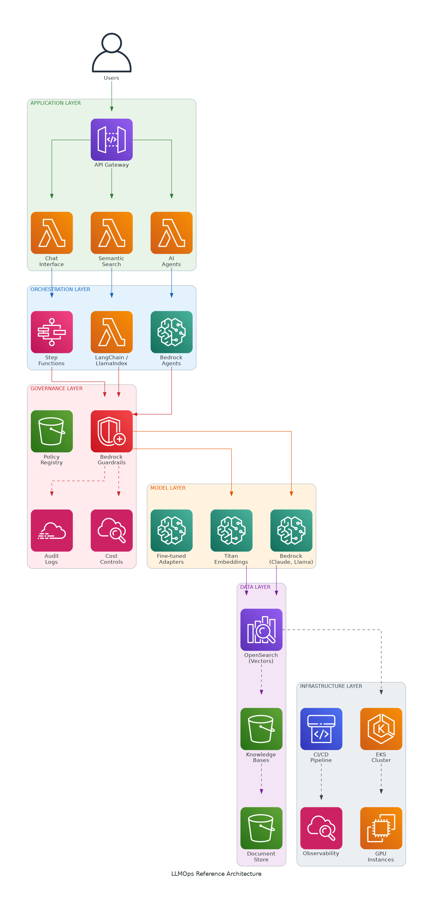
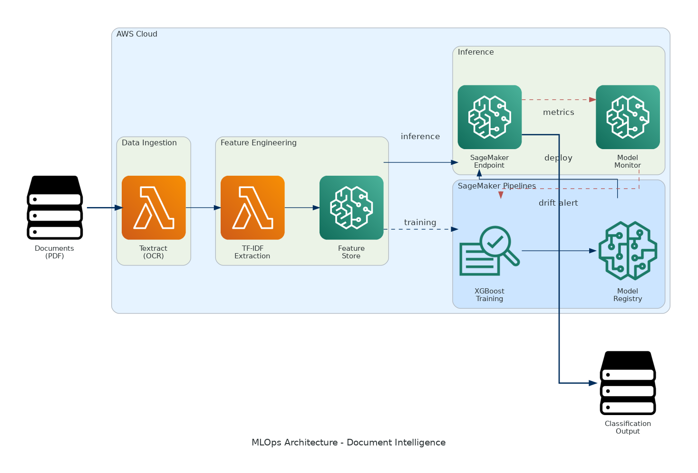
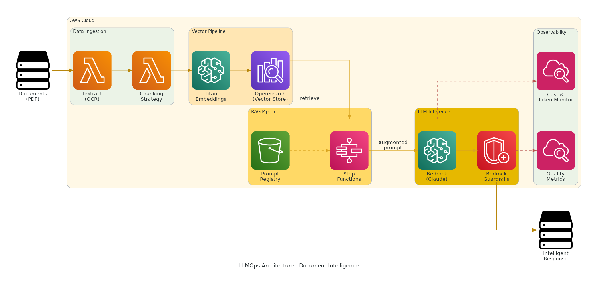
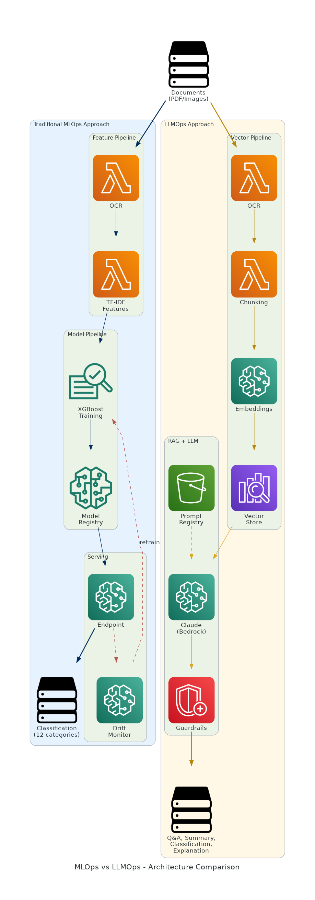

# From MLOps to LLMOps: A Systematic Framework for Operationalizing Large Language Models in Production

## Research Paper Outline

---

## Metadata

| Field | Value |
|-------|-------|
| **Working Title** | From MLOps to LLMOps: A Systematic Framework for Operationalizing Large Language Models in Production |
| **Alternative Title** | Extending MLOps for the Generative AI Era: Principles, Patterns, and Platform Requirements |
| **Target Venues** | IEEE Software, ICSE SEIP, MLSys |
| **Methodology** | Design Science Research + Case Study |
| **Status** | Outline |

---

## Abstract

The rapid adoption of Large Language Models (LLMs) has exposed fundamental gaps in traditional MLOps practices. While MLOps successfully addresses the deployment of conventional ML models through pipelines, feature stores, and model registries, LLMs introduce novel operational challenges: prompt versioning, retrieval-augmented generation (RAG) pipelines, vector store management, guardrails enforcement, and new evaluation metrics such as hallucination rate and factuality. This paper proposes a systematic LLMOps framework that extends MLOps principles to address these challenges. Using design science research methodology, we identify the unique artifact types, pipeline stages, and governance requirements for LLM systems. We validate our framework through a comparative case study of document intelligence systems, contrasting traditional MLOps and LLMOps approaches. Our contribution provides practitioners with actionable guidance for transitioning from MLOps to LLMOps and researchers with a foundational taxonomy for this emerging field.

**Keywords:** MLOps, LLMOps, Large Language Models, DevOps, Machine Learning Operations, Generative AI, RAG, Prompt Engineering

---

## 1. Introduction

### 1.1 Opening Hook

> "If traditional ML models can be continuously deployed with MLOps, why do LLM deployments remain largely ad-hoc?"

The emergence of Large Language Models has transformed artificial intelligence from a specialized capability into a general-purpose technology. Organizations that mastered MLOps—achieving automated pipelines, continuous training, and production monitoring—now face a new challenge: their hard-won practices are insufficient for LLM deployment.

### 1.2 Problem Statement

- MLOps maturity models (Google's Level 0-1-2) don't account for LLM-specific artifacts
- 87% of ML projects remain stuck at Level 0; LLM projects face even greater operational challenges
- Organizations applying MLOps patterns to LLMs encounter novel requirements:
  - Prompts as first-class artifacts requiring versioning
  - RAG pipelines introducing retrieval accuracy as a new concern
  - Token economics fundamentally changing cost models
  - Hallucination detection as a critical safety requirement
- No systematic framework exists for LLMOps

### 1.3 Research Questions

| ID | Research Question |
|----|-------------------|
| **RQ1** | What are the unique operational challenges of LLMs that traditional MLOps does not address? |
| **RQ2** | How should MLOps practices be extended or modified to support LLM deployment? |
| **RQ3** | What new artifact types, metrics, and governance mechanisms are required for LLMOps? |

### 1.4 Contributions

1. **Taxonomy of LLMOps-specific challenges** — systematic categorization of operational gaps
2. **Extended maturity model** — Level 0-1-2 adapted for LLM systems
3. **Reference architecture** — layered platform design for LLMOps
4. **Validation through case study** — document intelligence comparison (MLOps vs LLMOps)
5. **Tool mapping** — existing platforms mapped to framework components

### 1.5 Paper Structure

- Section 2: Background and Related Work
- Section 3: Research Methodology
- Section 4: The LLMOps Framework
- Section 5: Case Study: Document Intelligence
- Section 6: Evaluation and Discussion
- Section 7: Conclusion

---

## 2. Background and Related Work

### 2.1 MLOps Foundations

#### 2.1.1 Definition and Evolution
- MLOps as the intersection of ML, DevOps, and Data Engineering
- Historical progression from manual notebooks to automated pipelines
- Key drivers: reproducibility, scalability, compliance

#### 2.1.2 Google's MLOps Maturity Model
- **Level 0 (Manual):** Script-based, notebook-driven, manual handoffs
- **Level 1 (Pipeline Automation):** Automated training pipelines, continuous training
- **Level 2 (CI/CD Automation):** Full automation including model validation, A/B testing

#### 2.1.3 Core MLOps Components
- **Pipelines:** Orchestrated workflows (Kubeflow, SageMaker Pipelines, MLflow)
- **Feature Stores:** Consistent feature serving (Feast, Tecton, SageMaker Feature Store)
- **Model Registries:** Version control for models (MLflow, SageMaker, Weights & Biases)
- **Monitoring:** Drift detection, performance tracking (Evidently, SageMaker Model Monitor)

### 2.2 DevOps and MLOps Convergence

#### 2.2.1 Shared Infrastructure
- Git for version control (code + config + IaC)
- CI/CD pipelines (GitHub Actions, Jenkins, CodePipeline)
- Container orchestration (Kubernetes, ECS)
- Observability (Prometheus, CloudWatch, Datadog)

#### 2.2.2 Divergent Concerns
- Data versioning (DVC, Delta Lake) — not present in traditional DevOps
- Feature engineering — domain-specific transformations
- Continuous Training (CT) — retraining triggered by data changes
- Model-specific monitoring — drift detection, performance degradation

### 2.3 Large Language Models in Production

#### 2.3.1 Deployment Patterns
- **API-based:** Using provider APIs (OpenAI, Anthropic, Bedrock)
- **Self-hosted:** Running open models (Llama, Mistral) on own infrastructure
- **Fine-tuned:** Custom models trained on domain data (LoRA, QLoRA, PEFT)
- **Hybrid:** Combining patterns based on use case requirements

#### 2.3.2 Emerging Operational Challenges
- Prompt management and versioning
- RAG pipeline orchestration
- Guardrails and safety enforcement
- Hallucination detection and mitigation
- Token-based cost management
- Agent orchestration for multi-step reasoning

#### 2.3.3 Current Industry Practices
- Largely ad-hoc, fragmented tooling
- Emerging frameworks: LangChain, LlamaIndex, Semantic Kernel
- Platform offerings: AWS Bedrock, Azure AI Studio, Google Vertex AI

### 2.4 Gap Analysis

| Capability | MLOps Coverage | LLMOps Requirement | Gap |
|------------|----------------|--------------------|----|
| Model versioning | Full | Partial (fine-tuned only) | Prompt versioning needed |
| Feature management | Full | Different paradigm | Vector stores, embeddings |
| Training automation | Full | Limited applicability | Prompt optimization, RAG tuning |
| Drift detection | Data + model drift | + Semantic drift | New detection methods |
| Cost management | Compute-based | Token-based | New economics model |
| Safety | Bias detection | + Hallucination, toxicity | New guardrails |

---

## 3. Research Methodology

### 3.1 Design Science Research Approach

We adopt Design Science Research (DSR) as our primary methodology, following Hevner et al.'s framework. DSR is appropriate because:
- We are creating a novel artifact (the LLMOps framework)
- The artifact must solve a practical problem (LLM operationalization)
- Evaluation requires demonstration of utility

### 3.2 Research Phases

| Phase | Activity | Output |
|-------|----------|--------|
| **1. Problem Identification** | Literature review, practitioner interviews | Gap analysis, requirements |
| **2. Framework Design** | Iterative development based on MLOps extension | LLMOps framework v1.0 |
| **3. Demonstration** | Case study implementation | Document intelligence comparison |
| **4. Evaluation** | Expert validation, comparative analysis | Validated framework |
| **5. Communication** | This paper | Academic contribution |

### 3.3 Data Collection

#### 3.3.1 Literature Sources
- Academic databases: IEEE Xplore, ACM DL, arXiv
- Grey literature: Cloud provider documentation, vendor whitepapers
- Industry reports: Gartner, Forrester, O'Reilly surveys

#### 3.3.2 Case Study Design
- Single embedded case study (Yin, 2018)
- Unit of analysis: Document intelligence system
- Embedded units: MLOps implementation, LLMOps implementation
- Comparison across architectural dimensions

### 3.4 Validation Strategy

- **Internal validity:** Triangulation across literature, case study, expert review
- **External validity:** Framework applicability across domains (discussed in limitations)
- **Construct validity:** Clear operationalization of LLMOps concepts

---

## 4. The LLMOps Framework

### 4.1 Taxonomy of LLM-Specific Artifacts

#### 4.1.1 Artifact Categories

| Artifact Type | MLOps Equivalent | LLMOps Specifics |
|---------------|------------------|------------------|
| **Prompts** | Config files | Versioned templates, few-shot examples, system instructions |
| **RAG Pipelines** | Feature pipelines | Retrieval + generation orchestration, chunking strategies |
| **Vector Stores** | Feature stores | Embedding indices, similarity search, hybrid retrieval |
| **Guardrails** | Validation rules | Safety filters, content policies, PII detection, output validation |
| **Agents** | — (new) | Multi-step reasoning, tool definitions, orchestration logic |
| **Fine-tuning Configs** | Training configs | LoRA/QLoRA adapters, PEFT parameters, training data |

#### 4.1.2 Artifact Lifecycle
- Creation and versioning
- Testing and validation
- Deployment and rollback
- Monitoring and iteration

### 4.2 Extended Pipeline Stages

#### 4.2.1 Traditional MLOps Pipeline
```
Data → Features → Train → Evaluate → Register → Deploy → Monitor
```

#### 4.2.2 LLMOps Pipeline (Extended)
```
Data → Chunk → Embed → Index → Prompts → [Fine-tune] →
Evaluate → Guardrails → Deploy → Monitor (drift + hallucination + cost)
```

#### 4.2.3 New Stage Descriptions

| Stage | Purpose | Key Activities |
|-------|---------|----------------|
| **Chunking** | Document segmentation | Size optimization, overlap strategy, metadata preservation |
| **Embedding** | Vector representation | Model selection, dimensionality, batch processing |
| **Indexing** | Vector store population | Index type, similarity metric, update strategy |
| **Prompt Engineering** | Template design | System prompts, few-shot examples, output formatting |
| **Guardrails Integration** | Safety enforcement | Input filtering, output validation, PII handling |
| **Agent Orchestration** | Multi-step reasoning | Tool registration, state management, error handling |

### 4.3 New Metrics and Monitoring

#### 4.3.1 Metrics Taxonomy

| Category | Traditional MLOps | LLMOps Extension |
|----------|-------------------|------------------|
| **Quality** | Accuracy, F1, AUC, MAE | Hallucination rate, factuality score, relevance, coherence |
| **Performance** | Latency (ms), throughput (req/s) | Time-to-first-token (TTFT), tokens/second, streaming latency |
| **Cost** | Compute hours, storage GB | Input tokens, output tokens, cost per request, fine-tuning cost |
| **Retrieval** | — | Retrieval accuracy, context relevance, chunk utilization |
| **Safety** | Bias metrics (Clarify) | Toxicity rate, PII leakage, policy violations, guardrail triggers |

#### 4.3.2 Monitoring Architecture
- Real-time dashboards for token usage and cost
- Automated hallucination detection pipelines
- Guardrail trigger analysis and tuning
- Semantic drift detection (embedding space monitoring)

### 4.4 LLMOps Maturity Model

#### 4.4.1 Level Definitions

| Level | Name | Characteristics |
|-------|------|-----------------|
| **Level 0** | Manual/Ad-hoc | Prompts hardcoded in application code; no versioning; manual RAG setup with static indices; no guardrails or ad-hoc filtering; evaluation through manual testing; no cost tracking |
| **Level 1** | Pipeline Automation | Prompt registry with version control; automated RAG index updates; basic guardrails (PII, toxicity); structured evaluation with test suites; cost monitoring and alerts; human-in-the-loop for critical decisions |
| **Level 2** | Full CI/CD + Governance | Prompt CI/CD with A/B testing; continuous RAG optimization; adaptive guardrails with feedback loops; automated hallucination detection; cost optimization (caching, model routing); full audit trail and compliance |

#### 4.4.2 Maturity Assessment Criteria

| Dimension | Level 0 | Level 1 | Level 2 |
|-----------|---------|---------|---------|
| Prompt Management | Hardcoded | Registry | CI/CD + A/B |
| RAG Pipeline | Manual | Automated refresh | Continuous optimization |
| Guardrails | None/Ad-hoc | Basic filters | Adaptive + monitored |
| Evaluation | Manual | Test suites | Automated + continuous |
| Cost Management | Unknown | Monitored | Optimized |
| Governance | None | Logging | Full audit + compliance |

### 4.5 Governance Extensions for LLMOps

#### 4.5.1 Regulatory Context
- EU AI Act classification for GenAI systems
- Transparency requirements for foundation models
- High-risk system obligations

#### 4.5.2 Governance Components

| Component | Purpose | Implementation |
|-----------|---------|----------------|
| **Prompt Auditing** | Track prompt changes and their effects | Version control, change logs, approval workflows |
| **Output Logging** | Archive responses for compliance | Structured logs, retention policies, searchability |
| **Guardrails-as-Code** | Codified safety policies | Policy files, automated enforcement, testing |
| **Cost Allocation** | Attribute costs to business units | Tagging, chargeback, budget enforcement |
| **Lineage Tracking** | End-to-end traceability | Query → retrieval → prompt → response chain |

### 4.6 Reference Architecture

#### 4.6.1 Layered Architecture



*Figure 1: Six-layer LLMOps reference architecture showing component organization and AWS service mapping*

The architecture consists of six layers, each with specific responsibilities:

#### 4.6.2 AWS Reference Implementation

| Layer | AWS Services |
|-------|--------------|
| Application | API Gateway, Lambda, AppRunner |
| Orchestration | Step Functions, Bedrock Agents |
| Governance | Bedrock Guardrails, CloudTrail, Cost Explorer |
| Model | Bedrock, SageMaker JumpStart, SageMaker Training |
| Data | OpenSearch (vectors), Kendra, S3, DynamoDB |
| Infrastructure | EKS, EC2, CodePipeline, CloudWatch, Terraform |

---

## 5. Case Study: Document Intelligence

### 5.1 Case Description

#### 5.1.1 Organization Context
- **Company:** TechCorp Solutions (pseudonym)
- **Size:** Mid-sized B2B software company (500 employees)
- **Domain:** Document processing for enterprise clients
- **Volume:** 50,000 documents/month (contracts, invoices, legal)

#### 5.1.2 Business Requirements
- Document classification (12 categories)
- Field extraction (15 predefined fields)
- Compliance checking (regulatory clauses)
- Question answering (new requirement)
- Summarization (new requirement)

### 5.2 MLOps Implementation (Current State)

#### 5.2.1 Architecture



*Figure 2: Traditional MLOps architecture for TechCorp's document intelligence system*

The pipeline follows this flow:
```
Documents → Textract (OCR) → TF-IDF Features → XGBoost → Classification
                ↓
        SageMaker Pipelines
                ↓
        Feature Store → Model Registry → Endpoint → Monitor
```

#### 5.2.2 Operational Characteristics
- **Maturity Level:** 1.5 (automated pipeline, basic monitoring, no CI/CD)
- **Accuracy:** 94% classification, 87% extraction
- **Latency:** 2.3 seconds per document
- **Cost:** $4,200/month
- **Retraining:** Manual trigger, 3-4 weeks for new document types

#### 5.2.3 Limitations
1. Cannot answer ad-hoc questions
2. Cannot summarize documents
3. Fixed extraction schema
4. No explainability for flags
5. Slow adaptation to new document types

### 5.3 LLMOps Implementation (Proposed State)

#### 5.3.1 Architecture



*Figure 3: LLMOps architecture with RAG pipeline, vector store, and guardrails for TechCorp*

The pipeline follows this flow:
```
Documents → Textract → Chunking → Titan Embeddings → OpenSearch
                                        ↓
                              RAG Pipeline (Step Functions)
                                        ↓
                    Prompt Registry → Claude (Bedrock) → Guardrails → Response
                                        ↓
                              Monitoring (hallucination, cost, quality)
```

#### 5.3.2 Operational Characteristics
- **Maturity Level:** 1 (targeting Level 2)
- **Accuracy:** 96% classification, 92% extraction (projected)
- **Latency:** 4.8 seconds per document
- **Cost:** $12,500/month (projected)
- **Adaptation:** Prompt changes only, days not weeks

#### 5.3.3 New Capabilities
1. Natural language Q&A over any document
2. Automatic summarization
3. Flexible clause detection
4. Explainable reasoning
5. Rapid adaptation through prompt engineering

### 5.4 Comparative Analysis



*Figure 4: Side-by-side comparison of MLOps and LLMOps architectures for document intelligence*

#### 5.4.1 Architecture Comparison

| Dimension | MLOps | LLMOps |
|-----------|-------|--------|
| Core model | XGBoost (custom trained) | Claude 3 (foundation model) |
| Data representation | TF-IDF (sparse) | Embeddings (dense) |
| Storage paradigm | Feature Store (tabular) | Vector Store (semantic) |
| Customization | Full retraining | Prompts + optional fine-tuning |
| Pipeline orchestration | SageMaker Pipelines | Step Functions + Bedrock |

#### 5.4.2 Artifact Comparison

| Artifact | MLOps | LLMOps |
|----------|-------|--------|
| Training data | 50K labeled examples | Few-shot examples (10-20) |
| Model artifact | XGBoost .pkl (50MB) | Prompt templates (10KB) |
| Feature definitions | TF-IDF config | Chunking + embedding config |
| Evaluation data | Held-out test set | Test suite + human eval |

#### 5.4.3 Metrics Comparison

| Metric | MLOps | LLMOps |
|--------|-------|--------|
| Primary quality | F1 score | F1 + hallucination rate |
| Latency | End-to-end (ms) | TTFT + generation time |
| Cost driver | Compute hours | Token consumption |
| Drift indicator | Feature distribution | Embedding drift + retrieval quality |

#### 5.4.4 Governance Comparison

| Requirement | MLOps Implementation | LLMOps Implementation |
|-------------|---------------------|----------------------|
| Lineage | SageMaker Experiments | + Prompt versions + retrieval logs |
| Explainability | SHAP values | Chain-of-thought + citations |
| Bias detection | Clarify pre/post | + Output bias monitoring |
| Audit trail | CloudTrail + logs | + Full conversation logs |

### 5.5 Migration Analysis

#### 5.5.1 Migration Path
- Phase 1: Pilot with single document type (invoices)
- Phase 2: Parallel run with automated comparison
- Phase 3: Gradual cutover with fallback

#### 5.5.2 Risk Assessment

| Risk | Likelihood | Impact | Mitigation |
|------|------------|--------|------------|
| Hallucination in extractions | Medium | High | Guardrails + confidence scoring |
| Cost overrun | High | Medium | Token budgets + caching |
| Latency regression | Medium | Medium | Async processing + streaming |
| Compliance gaps | Low | High | Comprehensive logging + audit |

---

## 6. Evaluation and Discussion

### 6.1 Framework Validation

#### 6.1.1 Completeness Assessment
- Does the framework cover all identified LLMOps challenges?
- Are there gaps in the taxonomy?

#### 6.1.2 Practical Applicability
- Can practitioners implement the framework with existing tools?
- What tooling gaps exist?

#### 6.1.3 Case Study Findings
- Framework successfully differentiated MLOps and LLMOps requirements
- Maturity model provided actionable assessment
- Reference architecture mapped to AWS services

### 6.2 Comparison with Related Work

| Aspect | Our Framework | Google MLOps | LangChain | AWS Well-Architected ML |
|--------|--------------|--------------|-----------|-------------------------|
| LLM-specific artifacts | Full coverage | Not addressed | Partial | Partial |
| Maturity model | Extended for LLMs | ML only | None | ML only |
| Governance | Comprehensive | Basic | Minimal | Comprehensive |
| Reference architecture | Yes | No | No | Yes |

### 6.3 Implications

#### 6.3.1 For Practitioners
- Clear roadmap for MLOps → LLMOps transition
- Tool selection guidance
- Governance checklist

#### 6.3.2 For Platform Providers
- Capability gaps to address
- Integration opportunities
- Standardization needs

#### 6.3.3 For Researchers
- Taxonomy for future research
- Evaluation metrics for LLMOps tools
- Open problems identified

### 6.4 Limitations

1. **Single case study:** Generalizability requires additional cases
2. **AWS focus:** Reference architecture specific to one cloud
3. **Rapidly evolving field:** Framework may require updates
4. **Quantitative validation:** Limited empirical metrics

### 6.5 Future Work

1. Multi-case validation across industries
2. Cloud-agnostic reference architecture
3. Automated maturity assessment tool
4. Longitudinal study of LLMOps evolution

---

## 7. Conclusion

### 7.1 Summary of Contributions

This paper presented a systematic framework for LLMOps that extends traditional MLOps practices to address the unique challenges of Large Language Model deployment. Our contributions include:

1. **Taxonomy:** Comprehensive categorization of LLMOps-specific artifacts (prompts, RAG pipelines, vector stores, guardrails, agents)

2. **Maturity Model:** Extended Level 0-1-2 framework adapted for LLM systems, enabling organizations to assess and improve their operational capabilities

3. **Reference Architecture:** Layered platform design with concrete AWS implementation mapping

4. **Case Study Validation:** Document intelligence comparison demonstrating practical applicability

### 7.2 Practical Recommendations

For organizations transitioning from MLOps to LLMOps:

1. **Start with governance:** Implement prompt versioning and output logging early
2. **Invest in evaluation:** Build hallucination detection before production deployment
3. **Plan for costs:** Token economics fundamentally differ from compute-based ML
4. **Iterate on RAG:** Retrieval quality often matters more than model selection
5. **Maintain hybrid capability:** Keep MLOps skills for cases where traditional ML is more appropriate

### 7.3 Closing Thought

> "The question is no longer whether organizations can deploy LLMs, but whether they can operate them reliably, safely, and economically at scale. LLMOps provides the answer."

---

## References

[To be populated with actual citations]

### Key References to Include:
1. Sculley, D. et al. (2015). Hidden Technical Debt in Machine Learning Systems. NeurIPS.
2. Google Cloud. (2021). MLOps: Continuous delivery and automation pipelines in machine learning.
3. Amershi, S. et al. (2019). Software Engineering for Machine Learning. ICSE-SEIP.
4. Paleyes, A. et al. (2022). Challenges in Deploying Machine Learning. ACM Computing Surveys.
5. EU AI Act (2024). Regulation on Artificial Intelligence.
6. AWS. (2024). Amazon Bedrock Documentation.
7. LangChain Documentation. (2024).
8. Yin, R. K. (2018). Case Study Research and Applications.

---

## Appendices

### Appendix A: Interview Protocol
[For practitioner interviews during framework development]

### Appendix B: Case Study Data Collection Instruments
[Structured templates for case documentation]

### Appendix C: Tool Mapping Matrix
[Comprehensive mapping of tools to framework components]

### Appendix D: Student Assignment Materials
[Reference to companion case study document]
